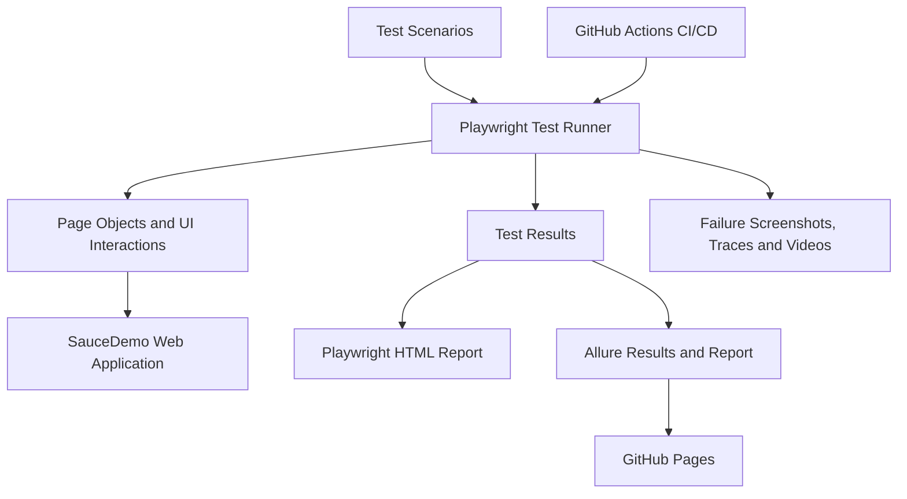

# Playwright TypeScript E-Commerce Automation Framework

<p align="center">
  <strong>End-to-End UI Automation | Cross-Browser Testing | CI/CD | Allure Reporting</strong>
</p>

<p align="center">
  <a href="https://github.com/sdet-kadarisuresh/playwright-typescript-ecommerce-automation">Source Code</a> •
  <a href="https://sdet-kadarisuresh.github.io/playwright-typescript-ecommerce-automation/">Live Allure Report</a> •
  <a href="https://github.com/sdet-kadarisuresh/playwright-typescript-ecommerce-automation/actions">GitHub Actions</a>
</p>

---

## 📌 Project Overview

This project demonstrates an end-to-end UI test automation framework built using **Playwright and TypeScript** for the SauceDemo e-commerce application.

The framework is designed to validate important user journeys, including authentication, product interactions, shopping cart operations, and checkout workflows. It also demonstrates cross-browser execution, automated test reporting, failure debugging, and continuous integration through GitHub Actions.

**The goal:** demonstrate practical QA automation engineering skills through a structured, maintainable, and CI/CD-integrated testing project.

## 🛠️ Technology Stack

| Technology | Purpose |
|---|---|
| Playwright | Browser automation and UI testing |
| TypeScript | Type-safe test development |
| Node.js & npm | Runtime and package management |
| Page Object Model (POM) | Organizing page interactions and test code |
| Git & GitHub | Version control and source management |
| GitHub Actions | Automated CI/CD test execution |
| Playwright HTML Reporter | Interactive test execution report |
| Allure | Test result visualization and reporting |
| GitHub Pages | Hosting the published Allure report |

## ✨ Key Features

- **Cross-browser testing:** Chromium, Firefox, and WebKit.
- **End-to-end scenarios:** Login, products, cart, and checkout.
- **Maintainable design:** Page Object Model-based organization.
- **Automated reporting:** Playwright HTML and Allure reports.
- **CI/CD integration:** Run automated tests through GitHub Actions.
- **Failure diagnostics:** Capture screenshots, traces, and videos on test failures, according to the configured Playwright settings.
- **Published reporting:** Access the Allure report through GitHub Pages.

## 🏗️ Framework Architecture

The framework separates test scenarios, reusable application interactions, configuration, and reporting responsibilities.



### Framework Components

**1. Test Layer**
- Contains automated test scenarios.
- Groups tests by application functionality.
- Validates expected application behavior.

**2. Page Interaction Layer**
- Uses the Page Object Model to organize page-specific interactions.
- Helps separate UI operations from test assertions.
- Supports easier maintenance when application elements change.

**3. Playwright Configuration**
- Defines the test directory and browser projects.
- Configures the application base URL and test ID attribute.
- Sets reporting, retries, parallel execution, and failure diagnostics.

**4. Reporting Layer**
- Generates Playwright HTML and JUnit test results.
- Integrates Allure for detailed test reporting.
- Publishes the Allure report through GitHub Pages using the configured workflow.

**5. CI/CD Layer**
- Uses GitHub Actions to automate test execution.
- Collects test artifacts for later inspection.
- Generates and publishes the Allure report according to workflow configuration.

## 📁 Repository Structure

```text
playwright-typescript-ecommerce-automation/
│
├── .github/
│   └── workflows/
│       └── playwright.yml
│
├── scripts/
│   └── generate-allure-environment.cjs
│
├── src/
│
├── tests/
│   ├── login.spec.ts
│   ├── login/
│   │   └── login.spec.ts
│   ├── products/
│   │   ├── fixtures.spec.ts
│   │   └── products.spec.ts
│   ├── cart/
│   │   └── cart.spec.ts
│   └── checkout/
│       └── checkout.spec.ts
│
├── playwright.config.ts
├── package.json
├── package-lock.json
├── .gitignore
└── README.md
```

*Note: This tree highlights the known repository files and folders. Expand the `src/` section with its actual contents if you want to document the implementation in more detail.*

## 🧪 Test Coverage

| Area | Testing focus |
|---|---|
| Login | Authentication scenarios and login behavior |
| Products | Product listing and product interactions |
| Shopping Cart | Cart operations and expected cart behavior |
| Checkout | Checkout workflow and relevant validations |
| Cross-browser | Execute the configured suite across Chromium, Firefox, and WebKit |

The exact scenarios and assertions are defined in the corresponding test files.

## 🔄 CI/CD Workflow

The project integrates with **GitHub Actions** to automate the testing and reporting process.

1. Trigger the configured workflow through a supported repository event.
2. Set up the Node.js environment and install dependencies.
3. Install the required Playwright browsers.
4. Execute the configured Playwright test suite.
5. Collect test reports and debugging artifacts.
6. Generate Allure reporting data and the report.
7. Publish the report to GitHub Pages when the workflow's publishing conditions are met.

This workflow demonstrates how UI automation can be incorporated into a continuous integration pipeline.

**Explore the workflow:**  
[GitHub Actions Runs](https://github.com/sdet-kadarisuresh/playwright-typescript-ecommerce-automation/actions)

## 📊 Reports & Execution Results

### Allure Report
Explore the published test report, including available suites, test results, and execution details.

➡️ [Open Live Allure Report](https://sdet-kadarisuresh.github.io/playwright-typescript-ecommerce-automation/)

### Playwright HTML Report
The Playwright HTML report can be opened locally after test execution.

### GitHub Actions
Review workflow runs, execution status, and available downloadable artifacts.

➡️ [View GitHub Actions](https://github.com/sdet-kadarisuresh/playwright-typescript-ecommerce-automation/actions)

## 💻 Getting Started

### Prerequisites

- Node.js and npm
- Git
- A code editor such as Visual Studio Code

### 1. Clone the repository

```bash
git clone https://github.com/sdet-kadarisuresh/playwright-typescript-ecommerce-automation.git
```

### 2. Open the project

```bash
cd playwright-typescript-ecommerce-automation
```

### 3. Install dependencies

```bash
npm install
```

### 4. Install Playwright browsers

```bash
npx playwright install
```

### 5. Run the test suite

```bash
npx playwright test
```

### 6. Run tests in a specific browser

```bash
npx playwright test --project=chromium
npx playwright test --project=firefox
npx playwright test --project=webkit
```

### 7. View the Playwright HTML report

```bash
npx playwright show-report
```

*Note: The commands above assume the corresponding scripts and browser projects remain configured in the repository.*

## 🔍 Failure Debugging

The Playwright configuration is set up to collect diagnostic information for failed tests.

- **Screenshots:** Help identify the UI state when a failure occurs.
- **Traces:** Help inspect browser actions, locators, and test execution.
- **Videos:** Help review the recorded browser session where available.
- **HTML report:** Helps identify failed tests and inspect execution details.

These artifacts support root-cause analysis and faster troubleshooting.

## 🎯 Engineering Goals

This project demonstrates practical experience with:

- Designing and organizing UI automation tests.
- Validating e-commerce user journeys.
- Running tests across multiple browser engines.
- Configuring automated reports and test diagnostics.
- Integrating automated tests into CI/CD.
- Publishing test reports for convenient review.

## 👨‍💻 Author

**Kadari Suresh**  
QA Automation Engineer | Playwright | TypeScript | Selenium | CI/CD

- **GitHub:** [@sdet-kadarisuresh](https://github.com/sdet-kadarisuresh)
- **Project Repository:** [Playwright TypeScript E-Commerce Automation](https://github.com/sdet-kadarisuresh/playwright-typescript-ecommerce-automation)

---

<p align="center">
  <strong>Automate with confidence. Validate continuously. Deliver quality.</strong>
</p>
